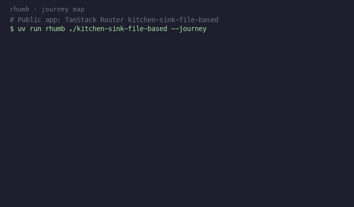

# Sample: TanStack Router kitchen-sink

Public source (not vendored in this repo):

https://github.com/TanStack/router/tree/main/examples/react/kitchen-sink-file-based



## Artifacts

| File | What |
|------|------|
| [`journeys.json`](./journeys.json) | Checked-in CLI output (`ends` + `gaps`) |
| [`demo.gif`](./demo.gif) | Terminal-style rendering of that output |
| [`render_gif.py`](./render_gif.py) | Regenerates the GIF from `journeys.json` |

Why this example: known public app, file-based TanStack routes, and real **gaps** (dynamic `Link` / `navigate`) so honesty shows up in the JSON.

## Reproduce JSON

```bash
mkdir -p /tmp/rhumb-demo && cd /tmp/rhumb-demo
git clone --depth 1 --filter=blob:none --sparse https://github.com/TanStack/router.git tanstack-router
cd tanstack-router && git sparse-checkout set examples/react/kitchen-sink-file-based

cd /path/to/rhumb
uv run rhumb /tmp/rhumb-demo/tanstack-router/examples/react/kitchen-sink-file-based --journey \
  | python3 -m json.tool > examples/tanstack-kitchen-sink/journeys.json
```

## Regenerate GIF

```bash
uv run --with pillow python examples/tanstack-kitchen-sink/render_gif.py
```
